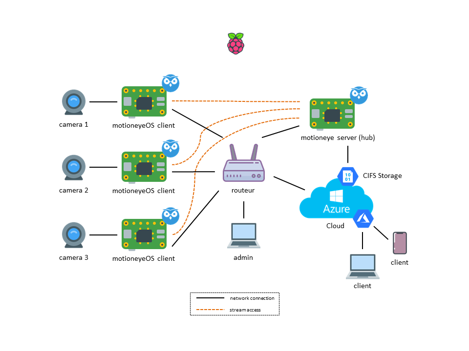

RaspberryPi home security camera livestream. Connecting system to the Azure Cloud with openVPN

### Architecture scenario with multiple devices with a hub

## Cloud Microsoft Azure
### Create a new VM (proxy server)
- connect to https://portal.azure.com/
- create a new server (linux debian) and authorize inbound security rule (port: 80, 443, 22)
- connect on the VM (ssh) > apt-get update && install curl netcat openvpn bridge-utils

### Configure Virtual Machine (redirect all connection to your raspberrypi motioneye server)
- run command as root 
    - iptables -t nat -A PREROUTING -p tcp -m tcp --dport 80 -j DNAT --to-destination ip:port
    - iptables -t nat -A POSTROUTING -j MASQUERADE
    - vi /etc/sysctl.conf (active net.ipv4.ip_forward=1)
    - sysctl -p
- test the connection
    - **FQDN NAME**.francecentral.cloudapp.azure.com
    - tcpdump -i any port 80

### Install openVPN
- run command as root
    - ip route add 192.168.0.0/24 dev tun0 (192.168.0.0/24 local ip network)
    - openvpn --genkey --secret azure.key
    - cp azure.key /etc/openvpn/
    - touch /etc/openvpn/up.sh
    - chmod 755 /etc/openvpn/up.sh
    - copy azure_server.conf > /etc/openvpn/azure.conf
    - /etc/init.d/openvpn restart
    - openvpn /etc/openvpn/azure.conf

### Configure Public IP
- Azure > Home > All resources > ""IP_AZURE"" > Configuration > Assignment > **STATIC**
- Azure > Home > All resources > ""IP_AZURE"" > Configuration > DNS name label > **FQDN NAME**

## home
### Install motioneye server
- Follow step by step
    - 1) https://www.raspberrypi.org/documentation/installation/noobs.md
    - 2) sudo raspi-config (active ssh)
    - 3) https://github.com/ccrisan/motioneye/wiki/Install-On-Raspbian (if the memory error displayed with rpi zero w => https://github.com/ccrisan/motioneye/issues/1230 or https://trevilly.com/videosurveillance-avec-motioneye-sur-raspbian-stretch-et-plusieurs-cameras/)
    - 4) apt-get install openvpn bridge-utils cifs-utils curl netcat vim
    - 5) modify /etc/dhcpcd.conf (only if you want a static ip address)
    - 6) copy azure.key (server)
    - 7) copy azure_client.conf > /etc/openvpn/azure.conf
    - 8) /etc/init.d/openvpn restart
    - 9) openvpn /etc/openvpn/azure.conf

### Install motioneyeOS (client)
- Follow step by step
    - 1) https://github.com/ccrisan/motioneyeos/wiki/Wifi-Preconfiguration
    - 2) modify /data/etc/static_ip.conf (only if you want a static ip address)

### Configure motioneye
- Connect to the motioneye server (ipaddress:8765) and add all cameras
- Configure cameras option
- Configure storage option (with CIFS https://ppolyzos.com/2016/09/09/map-network-drive-to-azure-storage-account-file-storage/ or https://www.lemagit.fr/actualites/450299683/Comment-utiliser-Azure-File-Storage-avec-Linux) 
- Connect to the Azure public ip
- Enjoy !
